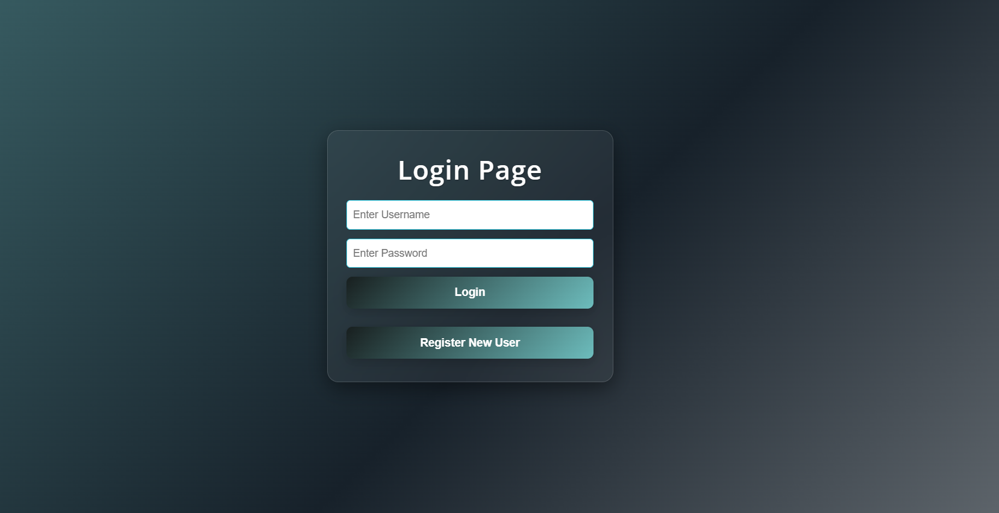
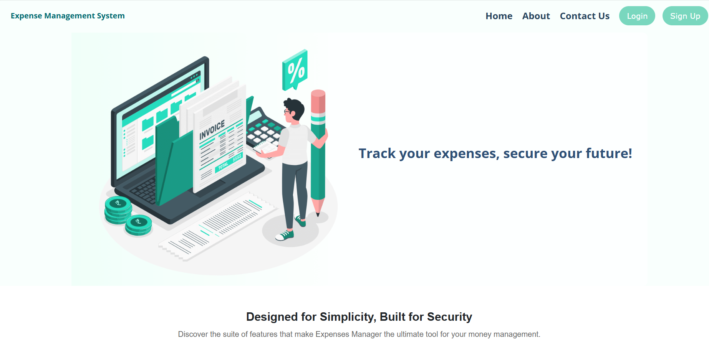
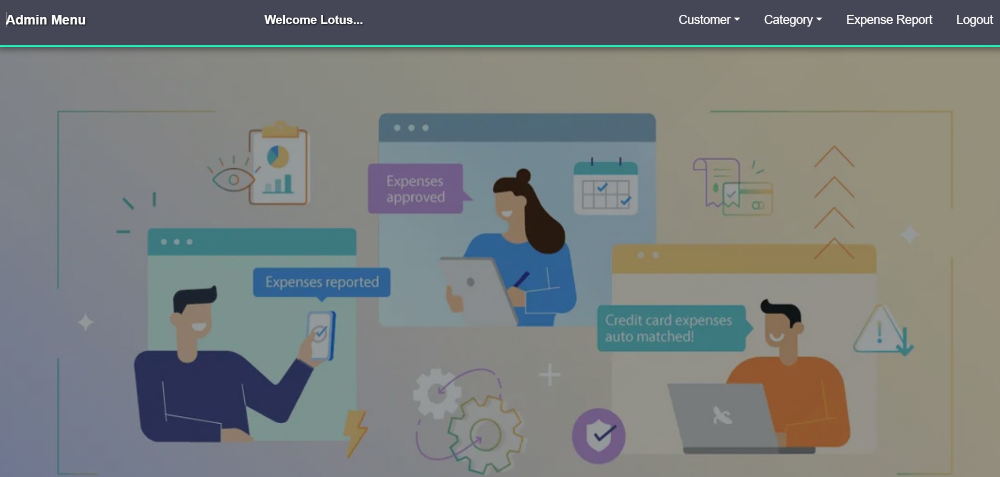
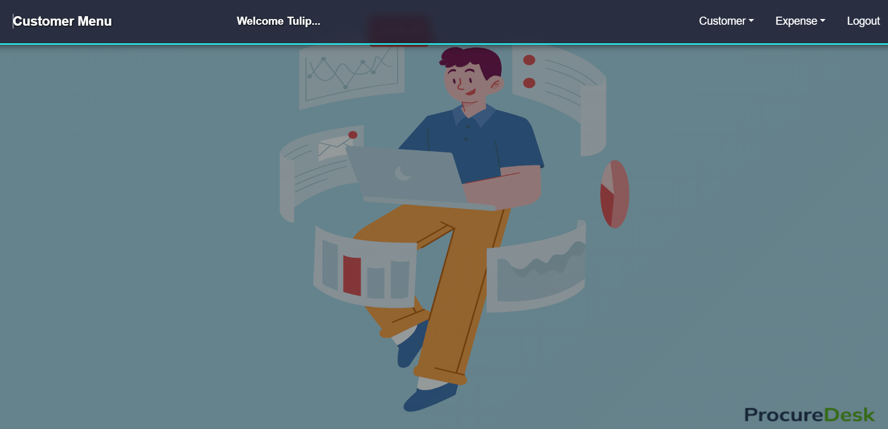
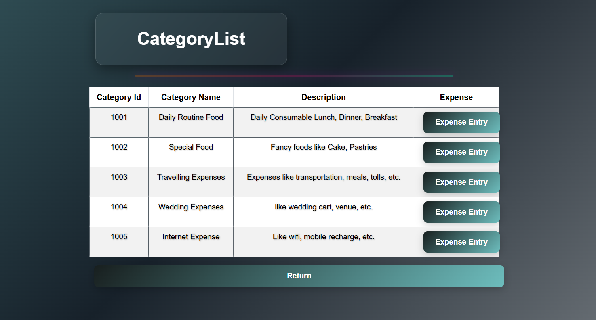
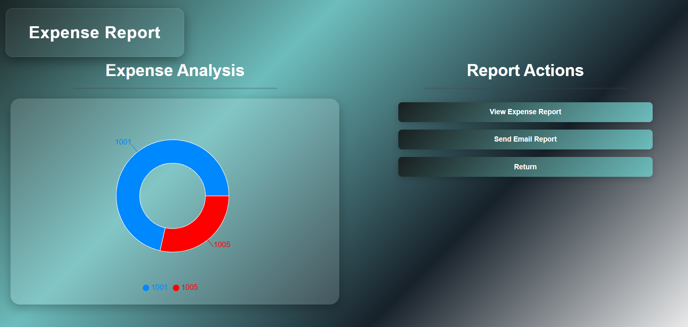

# 💰 Expense Management System

The *Expense Management System* is a robust web application designed to help users monitor, manage, and analyze their daily spending habits. It eliminates the hassle of manual tracking by offering an intuitive and efficient platform for financial planning and expense analysis.

---

## 📌 Overview

This system enables users to:
- Add and track their daily expenses.
- Categorize expenses for better financial insights.
- Generate visual reports (pie charts) and downloadable PDF summaries.
- Receive monthly or weekly reports via email.
- Maintain secure and personalized access through user authentication.

---

## 🚀 Features

### 👤 User Management
- Secure registration and login.
- Role-based access control (Admin/User).
- User profile management.

### 💵 Expense Tracking
- Add, update, delete daily expenses.
- View history of all expenses.

### 📂 Category Management
- Create and manage custom expense categories.
- Group expenses under predefined or user-defined categories.

### 📊 Report Generation
- Generate visual expense reports using *pie charts*.
- Create and download *PDF reports* similar to bank statements.
- Automatically *send reports via email* to the user.

---

## 🏗 Architecture

The application is built with a *monolithic architecture* and follows modular design principles for ease of maintenance and future scalability.

### 🔧 Modules

- *User Module* – Manages authentication, roles, and user data.
- *Expense Module* – Handles expense CRUD operations and filtering.
- *Category Module* – Enables expense categorization.
- *Report Module* –
  - Visualizes data using charts.
  - Generates downloadable PDFs.
  - Sends reports via email using an integrated mail service.

---

## 🛠 Tech Stack

| Layer        | Technology         |
|--------------|--------------------|
| Frontend     | React, Bootstrap   |
| Backend      | Java (Spring Boot) |
| Database     | MySQL              |
| Authentication | Spring Security |
| PDF Generation | iText Library   |
| Email Service  | Spring Boot Mail |

---

## 🔰 Getting Started

### ✅ Prerequisites

Make sure you have the following installed on your machine:

- [Node.js & npm](https://nodejs.org/)
- [Java JDK 17+](https://www.oracle.com/java/technologies/javase-downloads.html)
- [MySQL Server](https://dev.mysql.com/downloads/mysql/)
- [Maven](https://maven.apache.org/install.html)
- [Git](https://git-scm.com/)

---

### 📥 Installation

1. *Clone the repository:*

   ```bash
   git clone https://github.com/nirmal2342/Expense-Management-System.git
   cd Expense-Management-System

Some snapshots : 

---

## 📸 Snapshots

### 🔐 Login View



### 📊 Landing Page



### 🛡️ Admin Dashboard



### 👤 Customer Dashboard



### 📂 Category List



### 📈 Expense Report



